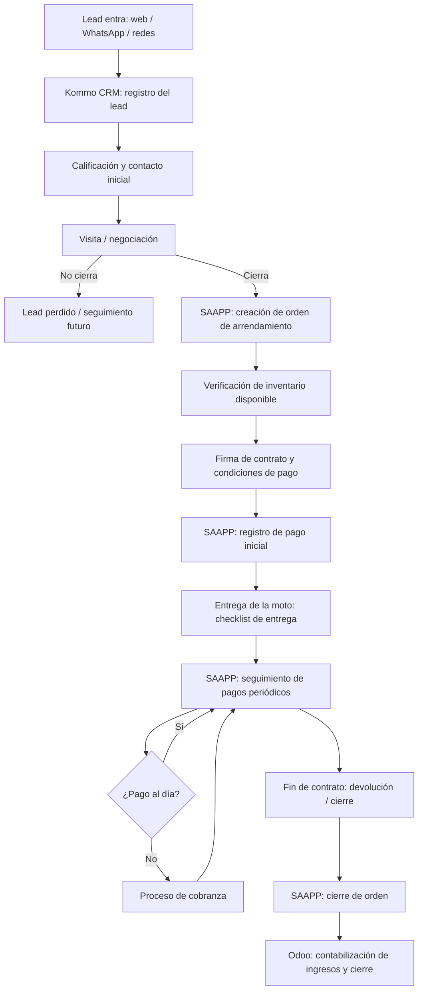

# Flujo Comercial v0

Primera versión del flujo de negocio de Arranca, insumo para instrumentar Kommo CRM y SAAPP. Es un borrador de trabajo — se revisa y ajusta con el negocio antes de darlo por definitivo.

## Puntos de traspaso entre sistemas
- **Kommo → SAAPP**: al cerrar la negociación (paso D→E), se crea la orden con los datos del cliente y la moto elegida.
- **SAAPP → Odoo**: cada pago registrado y cada cierre de contrato se contabiliza (paso H, N→O).
- **SAAPP ↔ Proveedor**: verificación de inventario disponible (paso F) y solicitudes de servicio/mantenimiento durante la vigencia del contrato.
- **SAAPP → Cobranza → Bancos**: el proceso de cobranza (paso L) es la base para la integración bancaria futura.

## Pendiente de validar con el negocio
- [ ] Confirmar canales reales de entrada de leads.
- [ ] Confirmar si existe una etapa de aprobación/verificación de crédito antes de la firma.
- [ ] Confirmar el detalle del checklist de entrega y de devolución.
- [ ] Confirmar reglas de mora y escalamiento de cobranza.
